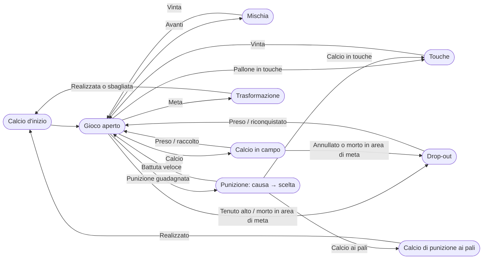
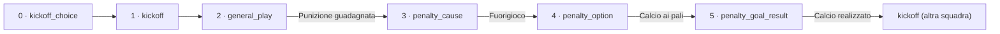
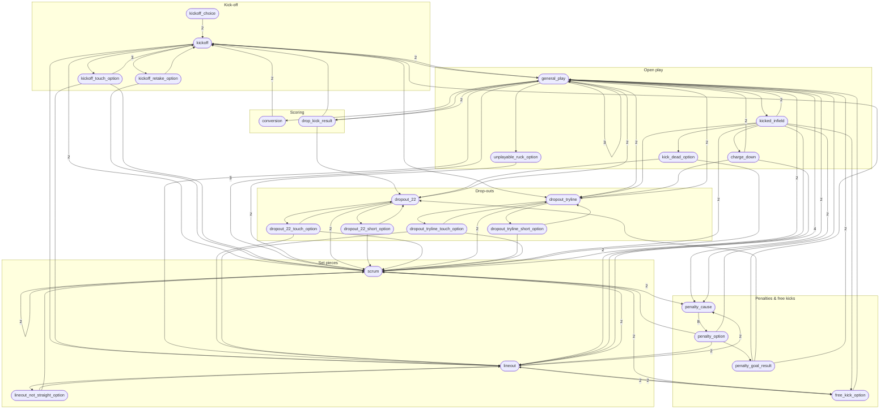

# 🏉 Rugby State Machine

[English](README.md) · **Italiano**

Un'app web per il **tagging live di partite di rugby a 15**: punteggio, cronometro, tutti gli
eventi di gioco (calci d'inizio, mischie, touche, punizioni, mete…), cartellini, sostituzioni e
vantaggio, con statistiche da rivedere dopo la partita. Può funzionare accanto al video della
partita, con il cronometro che segue il video.

La logica di gioco segue le *Laws of the Game* di World Rugby, comprese le modifiche in vigore
dal 1° luglio 2026. I commenti nel codice citano la regola di riferimento.

- [Funzionalità](#funzionalità)
- [Requisiti](#requisiti)
- [Avvio](#avvio)
- [Come si usa](#come-si-usa)
- [Utenti, ruoli e password](#utenti-ruoli-e-password)
- [Come funziona la logica di gioco](#come-funziona-la-logica-di-gioco)
- [Struttura del progetto](#struttura-del-progetto)
- [Sicurezza](#sicurezza)
- [Versioni](#versioni)
- [Sviluppo](#sviluppo)
- [Licenza](#licenza)

## Funzionalità

- **Due modalità**: *Live* (solo tagger, ad esempio su un tablet a bordo campo) e
  *Schermo diviso* (video a sinistra, tagger a destra, per taggare una partita registrata).
- **Tagging guidato dagli stati**: lo schermo propone solo le azioni possibili in quel momento,
  così una partita intera si tagga con uno o due tocchi per evento.
- **Cronometro agganciato al video** nello schermo diviso: se metti in pausa il video il
  cronometro si ferma, se salti avanti o indietro il cronometro segue.
- **Sorgenti video**: link YouTube o Vimeo, oppure un file video sul disco (letto in streaming,
  mai copiato).
- **Annulla** dell'ultima azione, che ripristina esattamente lo stato precedente.
- **Cartellini, sostituzioni, vantaggio** con nomi e colori delle squadre.
- **Statistiche**: possesso, marcature, calci ai pali (con mappa dei calci), maul, palloni
  recuperati, avanti, calci d'inizio riconquistati, e un cursore temporale per rivedere la
  partita evento per evento.
- **Export / import** di una o più partite in JSON.
- **Italiano e inglese**, riconosciuti dal browser e intercambiabili in ogni momento.
- **Utenti e ruoli**: accesso con nome utente e password, tre ruoli (amministratore, tagger,
  visualizzatore), gestione degli utenti dal browser.

## Requisiti

- **PHP 8.1+** con l'estensione `pdo_sqlite` (inclusa in XAMPP e nella maggior parte delle
  installazioni di PHP).
- Un browser moderno (Chrome, Edge, Firefox, Safari).
- Una connessione a internet solo per i video YouTube/Vimeo.

Niente server di database e niente pacchetti Composer: i dati stanno in un file SQLite
(`data/rugby.sqlite`) creato automaticamente al primo avvio.

## Avvio

### Windows

Doppio clic su **`start-server.bat`**: avvia il server integrato di PHP su
<http://localhost:8000> e apre il browser. Per fermarlo chiudi la finestra (o premi `Ctrl+C`).

### Qualsiasi sistema

```bash
php -S localhost:8000 router.php
```

Poi apri <http://localhost:8000>. Passa sempre `router.php`: il server integrato ignora
`.htaccess` e il router applica le stesse protezioni (vedi [Sicurezza](#sicurezza)).

### Apache

Copia la cartella nella document root (o in un virtual host) con `AllowOverride All` e rendi
`data/` scrivibile dal web server. Il `.htaccess` incluso blocca tutto tranne `index.php`,
`api/` e `assets/`.

Su un sito pubblico **usa solo HTTPS**: senza, password e cookie di sessione viaggiano in chiaro
(vedi [Utenti, ruoli e password](#utenti-ruoli-e-password)).

### Primo avvio: crea l'amministratore

La prima volta che apri l'app non esiste ancora nessun utente, quindi ogni pagina mostra
**Primo avvio**: scegli nome utente e password dell'amministratore. La pagina sparisce appena
l'account esiste. Su un sito pubblico fallo **subito dopo la pubblicazione**, prima che qualcun
altro trovi la pagina.

## Come si usa

### 0. Accedi

Ogni pagina richiede l'accesso. La barra in cima al menu mostra chi sei, la pagina **Account**
(per cambiare la tua password), **Utenti** (solo amministratori), **Esci** e il selettore di
lingua. Quello che puoi fare dipende dal ruolo: i visualizzatori non vedono *Nuova partita* né
*Importa* e aprono le partite sulla pagina delle statistiche.

### 1. Crea una partita

Dal menu scegli **Nuova partita**, inserisci le due squadre con i loro colori e scegli la modalità:

- **Live**: solo il tagger.
- **Schermo diviso**: ti viene chiesto subito il video:
  - **YouTube / Vimeo**: incolla il link;
  - **Video locale**: incolla il percorso completo del file
    (in Esplora risorse: `Maiusc` + tasto destro sul file → *Copia come percorso*).
    Formati supportati: mp4, m4v, mov, webm, ogv, mkv. Il file resta dov'è.

Il video si sceglie una volta sola, in questo passaggio: lo schermo diviso mostra solo il
video e il tagger.

### 2. Tagga la partita

| Zona | A cosa serve |
|---|---|
| Intestazione: squadre, punteggio, **⇄** | **⇄** scambia le squadre sinistra/destra |
| *Fine 1° tempo · Tempo fermo · Statistiche* | fase della partita, cronometro, statistiche |
| *🟨 Cartellino · 🔁 Cambio · ⏱ Vantaggio* e il cronometro | eventi che non cambiano lo stato del gioco |
| Titolo dello stato (es. *Possesso: Rovigo*) e pulsanti delle azioni | dove si trova la partita e cosa può succedere adesso |
| *Annulla: …* | annulla l'ultima azione |

- Si comincia scegliendo **chi batte il calcio d'inizio**: il cronometro parte con il primo
  calcio d'inizio.
- Ogni tocco porta la partita allo stato successivo; il titolo dice dove ti trovi
  (*Mischia a Padova*, *Punizione Rovigo — scelta*, …).
- **I colori dei pulsanti** dicono a quale squadra appartiene l'azione: *Vinta da …*,
  *Calcio libero a …* e **Punizione guadagnata** hanno il colore della squadra che li **ottiene**.
- **⇄** scambia le squadre a sinistra/destra (solo visualizzazione), così lo schermo
  corrisponde alla direzione di gioco in campo. Le finestre di cartellino, cambio e vantaggio
  seguono lo stesso ordine.
- **Tempo fermo / Riprendi tempo** ferma e fa ripartire il cronometro;
  **Fine 1° tempo / Fine partita** chiude il periodo.
- **Cartellino**, **Cambio** e **Vantaggio** registrano eventi che non cambiano lo stato del gioco.
- Quando si calcia ai pali puoi toccare il campo in miniatura per segnare il punto del calcio:
  alimenta la mappa dei calci nelle statistiche.

### 3. Schermo diviso: il cronometro segue il video

Dal momento in cui tocchi il **primo calcio d'inizio**, il cronometro è agganciato al video:

- video **in pausa** → cronometro fermo; video **in riproduzione** → cronometro che corre;
- **saltare** avanti o indietro nel video sposta anche il cronometro;
- **Tempo fermo / Riprendi tempo** mette in pausa e riprende il video;
- all'**intervallo** il cronometro si ferma e si riaggancia al video al calcio d'inizio del
  secondo tempo;
- riaprendo una partita, il video riparte dal punto corrispondente al cronometro.

Ogni evento viene salvato con il tempo del video, quindi la timeline delle statistiche
corrisponde alle immagini.

### 4. Statistiche

**Statistiche** mostra possesso, marcature, calci ai pali (percentuale e mappa), maul, palloni
recuperati, avanti e calci d'inizio riconquistati. Il cursore in basso fa rivivere la partita:
punteggio ed evento in ogni momento.

### 5. Export e import

Nel menu spunta una o più partite e premi **Esporta (n)**: ottieni un file JSON con le partite
e tutto il loro storico eventi. **Importa…** ricarica un file di questo tipo e aggiunge le
partite all'elenco. Il file viene prima controllato: se qualcosa non va non viene importato
nulla e ne viene mostrato il motivo. Importare due volte lo stesso file crea due copie.

### Lingua

L'app parte in italiano se il browser preferisce l'italiano, altrimenti in inglese. Con il
selettore **IT / EN** nel menu la cambi, e la scelta viene ricordata. Le etichette degli eventi
vengono salvate nella lingua usata durante il tagging.

## Utenti, ruoli e password

### Ruoli

| Ruolo | Cosa può fare |
|---|---|
| **Amministratore** | tutto, più la gestione degli utenti (creare, cambiare ruolo, disattivare, reimpostare la password, eliminare) |
| **Tagger** | creare e taggare partite, cartellini/cambi/vantaggio, export e import |
| **Visualizzatore** | vedere l'elenco delle partite e le statistiche, esportare; non può modificare nulla |

I permessi sono controllati **sul server**, per ogni pagina e ogni chiamata alle API: nascondere
un pulsante è solo una comodità. Tutte le partite sono condivise tra tutti gli utenti; il menu
mostra chi ha creato ciascuna.

### Gestire gli utenti (amministratori)

Dalla pagina **Utenti**:

- **Nuovo utente**: nome utente (3-40 caratteri tra lettere, cifre, `.` `_` `-`; maiuscole e
  minuscole non contano, quindi `Mario` e `mario` sono lo stesso utente), una **password
  temporanea** e il ruolo. Comunica la password alla persona in privato e chiedile di cambiarla
  da **Account** al primo accesso.
- **Ruolo** e **attivo** si cambiano in qualsiasi momento. Un utente disattivato non può
  accedere e le sue sessioni aperte si chiudono subito; le sue partite restano.
- **Reimposta password** assegna una nuova password temporanea e chiude tutte le sessioni
  dell'utente.
- **Elimina** cancella l'account; le partite che aveva creato restano (senza il nome dell'autore).
- Regole di sicurezza: un amministratore non può cambiare il proprio ruolo, disattivarsi o
  eliminarsi da solo, e deve sempre esistere almeno un amministratore attivo.

### Come vengono gestite le password

- **Mai salvate in chiaro.** Si salva solo un hash, calcolato con `password_hash()` di PHP
  (bcrypt, con salt, volutamente lento). Nemmeno un amministratore può leggere una password:
  può solo impostarne una nuova. Quando PHP adotta un algoritmo o un costo più robusto, l'hash
  viene aggiornato automaticamente al successivo accesso riuscito.
- **Mai scritte altrove**: non nei log, non nei file di export, mai rimandate indietro dal
  server. I moduli usano gli attributi `autocomplete` giusti, così i gestori di password
  funzionano correttamente.
- **Regole**: almeno **10 caratteri** (`PASSWORD_MIN_LENGTH`), al massimo 72 byte (limite di
  bcrypt). Non ci sono simboli obbligatori né scadenze periodiche: seguendo le linee guida NIST
  SP 800-63B conta più la lunghezza della complessità. Una breve frase come
  `mediano di mischia sotto la pioggia` è più facile da ricordare e più difficile da indovinare
  di `Rugby!2026`.
- **Cambiare la propria password** (**Account**) richiede la password attuale, così una
  sessione lasciata aperta su un computer condiviso non basta per impossessarsi dell'account.
  Tutte le *altre* sessioni (altri dispositivi o browser) vengono chiuse; quella corrente resta aperta.
- **Ogni cambio o reimpostazione di password e ogni disattivazione chiude le sessioni già
  aperte** di quell'utente (un contatore di sessione per utente viene verificato a ogni richiesta).

### Protezione dell'accesso

- **Tentativi a forza bruta**: dopo **5 tentativi falliti** per lo stesso nome utente, o **20**
  dallo stesso indirizzo IP, nell'arco di **15 minuti**, l'accesso per quel nome/indirizzo viene
  rifiutato finché la finestra non passa (`LOGIN_MAX_FAILURES_PER_USER`,
  `LOGIN_MAX_FAILURES_PER_IP`, `LOGIN_LOCK_WINDOW_SECONDS`).
- **Nessuna rivelazione degli utenti**: l'errore è identico per nome utente sbagliato e per
  password sbagliata, e la risposta impiega lo stesso tempo nei due casi.
- **Sessioni**: il cookie è `HttpOnly` (non leggibile dagli script), `SameSite=Lax` e `Secure`
  su HTTPS; l'identificativo di sessione cambia a ogni accesso; una sessione scade dopo **8 ore**
  di inattività (`SESSION_IDLE_SECONDS`).
- **Richieste da altri siti**: ogni operazione che modifica dati è una richiesta JSON accettata
  solo dal sito stesso.
- **HTTPS**: su un sito pubblico è indispensabile; senza, la password viaggia in chiaro al momento
  dell'accesso.

### Password dimenticata

- Chiedi a un **amministratore** di reimpostarla dalla pagina **Utenti**.
- Se la password dimenticata è quella dell'**unico amministratore**, usa la riga di comando del server:

  ```bash
  php tools/reset-password.php <nome-utente>
  ```

  Stampa una password temporanea casuale, chiude tutte le sessioni di quell'utente, toglie il
  blocco per tentativi falliti e riattiva l'account se era disattivato. Accedi e cambiala da
  **Account**. La cartella `tools/` non è raggiungibile dal web.

Tutti questi valori sono costanti in [`config.php`](config.php).

## Come funziona la logica di gioco

Tutta la logica di gioco sta in un unico file dichiarativo, [`src/States.php`](src/States.php):
un grafo di **stati** (es. *Mischia a …*), ognuno con le **azioni** disponibili. Ogni azione
indica a quale squadra appartiene, qual è lo stato successivo, quale squadra diventa
protagonista ("subject") e quanti punti vale. Gli stati sono scritti in termini di squadra
*subject* e *other*, quindi un solo stato vale per entrambe le squadre.

### Panoramica



Dopo ogni marcatura riparte con il calcio d'inizio **l'altra squadra** (Law 12).

### Profondità degli stati

Un evento può richiedere più tocchi in profondità. Per esempio una punizione calciata ai pali:



La tabella elenca tutti gli stati con la loro profondità, cioè il numero minimo di azioni per
raggiungerli dall'inizio della partita, e il numero di azioni che offrono:

| Profondità | Stato | Azioni | Titolo |
|---:|---|---:|---|
| 0 | `kickoff_choice` | 2 | Quale squadra batte il calcio d'inizio? |
| 1 | `kickoff` | 10 | Calcio d'inizio {SUBJECT} |
| 2 | `general_play` | 16 | Possesso: {SUBJECT} |
| 2 | `scrum` | 8 | Mischia a {SUBJECT} |
| 2 | `kickoff_retake_option` | 2 | Calcio d'inizio irregolare — scelta di {OTHER}: |
| 2 | `kickoff_touch_option` | 3 | Calcio d'inizio direttamente in touche — scelta di {OTHER}: |
| 2 | `lineout` | 11 | Touche a {SUBJECT} |
| 2 | `dropout_tryline` | 6 | Drop dalla linea di meta {SUBJECT} |
| 3 | `drop_kick_result` | 4 | Drop di {SUBJECT} |
| 3 | `conversion` | 2 | Trasformazione — {SUBJECT} |
| 3 | `kicked_infield` | 12 | Calcio in campo di {SUBJECT} |
| 3 | `penalty_cause` | 8 | Punizione {SUBJECT} — causa |
| 3 | `unplayable_ruck_option` | 2 | Ruck/placcaggio ingiocabile — mischia a: |
| 3 | `free_kick_option` | 3 | Calcio libero {SUBJECT} — scelta |
| 3 | `lineout_not_straight_option` | 2 | Lancio non dritto — scelta di {SUBJECT}: |
| 3 | `dropout_tryline_short_option` | 2 | Drop non oltre i 5 metri — scelta di {OTHER}: |
| 3 | `dropout_tryline_touch_option` | 3 | Drop direttamente in touche — scelta di {OTHER}: |
| 4 | `dropout_22` | 6 | Drop dai 22 {SUBJECT} |
| 4 | `charge_down` | 4 | Contrato da {OTHER} |
| 4 | `kick_dead_option` | 2 | Calcio morto oltre l'area di meta — scelta di {SUBJECT}: |
| 4 | `penalty_option` | 5 | Punizione {SUBJECT} — scelta |
| 5 | `dropout_22_short_option` | 2 | Drop non oltre i 22 — scelta di {OTHER}: |
| 5 | `dropout_22_touch_option` | 3 | Drop direttamente in touche — scelta di {OTHER}: |
| 5 | `penalty_goal_result` | 4 | Calcio di punizione ai pali — {SUBJECT} |

### Grafo completo degli stati

Ogni freccia è almeno un'azione; il numero su una freccia indica quante azioni diverse portano
da uno stato all'altro. I nomi degli stati sono gli identificatori usati nel codice.



## Struttura del progetto

```
index.php, router.php           punto d'ingresso; router per il server integrato di PHP
config.php, bootstrap.php       costanti (punti, percorsi), autoload, helper __() / _e()
schema.sql                      schema SQLite (creato automaticamente)
src/States.php                  il grafo di gioco: le regole del gioco come dati
src/StateMachine.php            applica un'azione allo stato corrente
src/MatchRepository.php         scrive partite ed eventi nel database
src/StatsCalculator.php         statistiche, ricalcolate dallo storico eventi
src/MatchArchive.php            formato e validazione di export/import JSON
src/VideoSource.php             riconoscimento e validazione YouTube/Vimeo/file locale
src/I18n.php                    rilevamento della lingua e traduzioni
src/Auth.php                    sessioni, accesso, controllo dei permessi di pagine e API
src/UserRepository.php          utenti, hash delle password, tentativi di accesso falliti
src/Role.php                    ruoli: amministratore > tagger > visualizzatore
CHANGELOG.md                    modifiche di ogni versione
lang/en.php, lang/it.php        dizionari
api/*.php                       endpoint JSON, uno per operazione
pages/*.php, pages/partials/    pagine HTML (il comportamento sta in assets/js)
assets/js/app.js                tagger;  video.js: player;  stats.js: statistiche
tools/                          controlli e generatori da riga di comando (vedi Sviluppo)
data/                           database SQLite (non versionato)
```

Lo **storico eventi** è la fonte di verità: punteggio, statistiche, annulla e timeline derivano
tutti da lì, non ci sono contatori tenuti a mano.

## Sicurezza

L'accesso richiede un account (vedi [Utenti, ruoli e password](#utenti-ruoli-e-password)).
Vengono serviti solo `index.php`, `api/*.php` e `assets/*`:

- **`.htaccess`** (Apache): nega i file nascosti, il database e qualsiasi file
  `.sqlite/.sql/.ini/.md/.json…`, le cartelle interne (`data/`, `src/`, `pages/`, `lang/`,
  `tools/`), disattiva l'elenco delle cartelle e aggiunge header di sicurezza. Le cartelle
  interne hanno anche un proprio `.htaccess` che nega tutto.
- **`router.php`** applica le stesse regole al server integrato di PHP (`php -S … router.php`).
- Il file video locale viene letto solo dal percorso salvato per la partita: l'endpoint non
  legge mai un percorso che arriva dalla richiesta.

## Versioni

Il progetto segue il [Semantic Versioning](https://semver.org/lang/it/): `MAJOR.MINOR.PATCH`.

- La versione corrente è la costante `APP_VERSION` in [`config.php`](config.php) (l'unico punto
  in cui il numero è scritto) e compare in fondo al menu.
- Ogni rilascio è un tag git `vMAJOR.MINOR.PATCH` (es. `v1.0.0`), elencato nelle
  [Releases](https://github.com/fproperzi/rugby_state_machine/releases).
- Cosa cambia in ogni versione è in [`CHANGELOG.md`](CHANGELOG.md) (in inglese, come d'uso su GitHub).
- I file di export hanno una propria versione di formato (`version`, verificata all'import) e,
  a titolo informativo, la `app_version` che li ha prodotti.

### Cosa è major, minor, patch

| Modifica | Versione |
|---|---|
| Correzione di un bug, traduzione, testi, grafica; correzione di una regola che non rinomina né toglie stati o azioni | **PATCH** (1.0.**1**) |
| Nuova funzionalità che lascia funzionare i dati esistenti: nuovi stati o azioni nel grafo, nuove pagine, nuove statistiche, nuove colonne/tabelle aggiunte da sole ai database esistenti | **MINOR** (1.**1**.0) |
| Una modifica che rompe dati o file esistenti: rinominare o togliere l'id di uno stato o di un'azione (gli eventi vecchi non si potrebbero più annullare, gli export vecchi non si importerebbero più), un formato di export che non legge i file vecchi, una modifica del database che richiede una migrazione manuale | **MAJOR** (**2**.0.0) |

### Rilasciare una nuova versione

1. In [`CHANGELOG.md`](CHANGELOG.md) sposta le voci di *Unreleased* sotto un nuovo titolo
   `## [X.Y.Z] - AAAA-MM-GG` e aggiorna i link di confronto in fondo al file.
2. Imposta `APP_VERSION` in [`config.php`](config.php) a `X.Y.Z`.
3. Lancia i controlli (e rigenera i diagrammi se il grafo è cambiato, vedi [Sviluppo](#sviluppo)):

   ```bash
   for f in *.php api/*.php src/*.php pages/*.php pages/partials/*.php lang/*.php tools/*.php; do php -l "$f"; done
   php tools/check-i18n.php
   ```

4. Commit, tag e push:

   ```bash
   git commit -am "Release vX.Y.Z"
   git tag -a vX.Y.Z -m "vX.Y.Z"
   git push origin main --follow-tags
   ```

5. Se vuoi, crea su GitHub una Release dal tag, incollando la sezione del changelog.

### Aggiornare un'installazione

1. **Fai una copia di `data/rugby.sqlite`** (contiene partite e utenti).
2. Sostituisci i file dell'applicazione con la nuova versione, lasciando la cartella `data/`.
3. Apri l'app: nuove tabelle e colonne vengono aggiunte da sole al database esistente alla prima
   richiesta. Una versione **MAJOR** elenca in [`CHANGELOG.md`](CHANGELOG.md) gli eventuali passi manuali.

## Sviluppo

```bash
php tools/check-i18n.php                # ogni chiave usata esiste in ogni lingua; ogni etichetta di gioco è tradotta
php tools/graph-mermaid.php graph       # rigenera il grafo completo degli stati per questo README
php tools/graph-mermaid.php depth it    # rigenera la tabella delle profondità (senza "it" quella inglese)
php tools/reset-password.php <utente>   # reimpostazione d'emergenza della password (vedi Password dimenticata)
```

Per cambiare una regola di gioco modifica [`src/States.php`](src/States.php) (il motore
raramente va toccato), aggiungi in [`lang/it.php`](lang/it.php) la traduzione italiana delle
nuove etichette, poi lancia i due strumenti qui sopra.

## Licenza

Copyright (C) 2026 gli autori di Rugby State Machine.

Questo programma è software libero: puoi ridistribuirlo e/o modificarlo secondo i termini
della GNU General Public License pubblicata dalla Free Software Foundation, nella versione 3
o (a tua scelta) in una qualsiasi versione successiva.

Questo programma è distribuito nella speranza che sia utile, ma SENZA ALCUNA GARANZIA, nemmeno
quella implicita di COMMERCIABILITÀ o di IDONEITÀ A UNO SCOPO PARTICOLARE. Il testo completo
della licenza (in inglese, l'unico con valore legale) è nel file [LICENSE](LICENSE).

SPDX-License-Identifier: `GPL-3.0-or-later`
