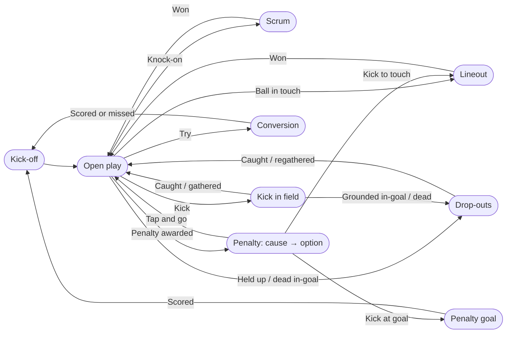
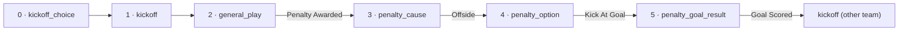
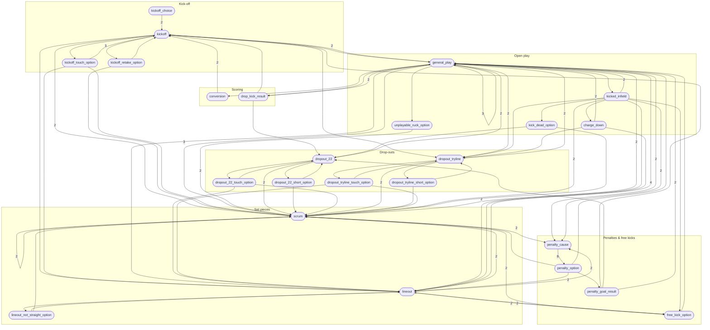

# 🏉 Rugby State Machine

**English** · [Italiano](README.it.md)

A web app for **live tagging of rugby union matches**: score, match clock, every game event
(kick-offs, scrums, lineouts, penalties, tries…), cards, substitutions and advantage, with
statistics you can review afterwards. It can run next to the match video, with the clock
following the video.

The game logic follows the World Rugby *Laws of the Game*, including the amendments in force
from 1 July 2026. The comments in the code cite the relevant law for each rule.

- [Features](#features)
- [Requirements](#requirements)
- [Getting started](#getting-started)
- [How to use it](#how-to-use-it)
- [Users, roles and passwords](#users-roles-and-passwords)
- [How the game logic works](#how-the-game-logic-works)
- [Project structure](#project-structure)
- [Security](#security)
- [Versioning](#versioning)
- [Development](#development)
- [License](#license)

## Features

- **Two modes**: *Live* (tagger only, e.g. on a tablet at the ground) and *Split screen*
  (video on the left, tagger on the right, for tagging a recorded match).
- **State-driven tagging**: the screen only offers the actions that are possible at that
  moment, so a whole match is tagged with one or two taps per event.
- **Clock synced to the video** in split mode: pause the video and the match clock stops,
  seek and the clock follows.
- **Video sources**: YouTube or Vimeo links, or a video file on your disk (streamed, never copied).
- **Undo** of the last action, restoring the exact previous state.
- **Cards, substitutions, advantage** with the team names and colours.
- **Statistics**: possession, scores, kicks at goal (with a kick map), mauls, turnovers,
  knock-ons, reclaimed kick-offs, and a time scrubber to replay the match event by event.
- **Export / import** one or more matches as JSON.
- **Italian and English**, detected from the browser and switchable at any time.
- **Users and roles**: sign-in required, three roles (administrator, tagger, viewer),
  user management from the browser.

## Requirements

- **PHP 8.1+** with the `pdo_sqlite` extension (included in XAMPP and most PHP builds).
- A modern browser (Chrome, Edge, Firefox, Safari).
- An internet connection only for YouTube/Vimeo videos.

No database server and no Composer packages: data is stored in a SQLite file
(`data/rugby.sqlite`) that is created automatically on first use.

## Getting started

### Windows

Double-click **`start-server.bat`**: it starts PHP's built-in server on
<http://localhost:8000> and opens the browser. Close the window (or press `Ctrl+C`) to stop it.

### Any system

```bash
php -S localhost:8000 router.php
```

Then open <http://localhost:8000>. Always pass `router.php`: the built-in server ignores
`.htaccess`, and the router applies the same protections (see [Security](#security)).

### Apache

Copy the folder into the document root (or a virtual host) with `AllowOverride All` and make
`data/` writable by the web server. The included `.htaccess` blocks everything except
`index.php`, `api/` and `assets/`.

On a public website **serve it over HTTPS only**: without it, passwords and the session cookie
travel in clear text (see [Users, roles and passwords](#users-roles-and-passwords)).

### First run: create the administrator

The first time the app is opened no user exists yet, so every page shows **First setup**:
choose the administrator's username and password. The page disappears as soon as the account
exists. On a public site, do this **right after publishing**, before anybody else finds the page.

## How to use it

### 0. Sign in

Every page requires signing in. The bar at the top of the menu shows who you are, the
**Account** page (to change your password), **Users** (administrators only), **Sign out**
and the language switch. What you can do depends on your role: viewers do not see
*New Match* or *Import* and open matches on the statistics page.

### 1. Create a match

From the menu choose **New Match**, enter the two teams and their colours, and pick the mode:

- **Live**: tagger only.
- **Split screen**: you are asked for the video right away:
  - **YouTube / Vimeo**: paste the link;
  - **Local video**: paste the full path of the file
    (in Windows File Explorer: `Shift` + right-click the file → *Copy as path*).
    Supported formats: mp4, m4v, mov, webm, ogv, mkv. The file stays where it is.

The video is chosen once, at this step; the split screen shows only the video and the tagger.

### 2. Tag the match

| Area | What it is for |
|---|---|
| Header: teams, score, **⇄** | **⇄** swaps the teams left/right |
| *Half-Time · Time Off · Show Stats* | match phase, clock, statistics |
| *🟨 Card · 🔁 Sub · ⏱ Advantage* and the clock | events that don't change the game state |
| State title (e.g. *Possession: Rovigo*) and action buttons | where the match is now, and what can happen next |
| *Undo …* | cancels the last action |

- Start with **who kicks off**: the match clock starts with the first kick-off.
- Each tap moves the match to the next state; the title tells you where you are
  (*Scrum to Padova*, *Penalty Rovigo — Option*, …).
- **Button colours** tell you which team the action belongs to: *Won by …*, *Free Kick to …*
  and **Penalty Awarded** take the colour of the team that **gains** them.
- **⇄** swaps the teams left/right (display only), so the screen matches the direction of
  play on the pitch. The card, substitution and advantage windows follow the same order.
- **Time Off / Time On** stops and restarts the clock; **Half-Time / Full-Time** closes the period.
- **Card**, **Sub** and **Advantage** record events that don't change the game state.
- When a kick at goal is taken you can tap the small pitch to mark where it was taken from:
  it feeds the kick map in the statistics.

### 3. Split screen: the clock follows the video

From the moment you tap the **first kick-off**, the match clock is tied to the video:

- video **paused** → clock stopped; video **playing** → clock running;
- **seeking** forwards or backwards moves the clock too;
- **Time Off / Time On** pauses and resumes the video;
- at **half-time** the clock stops and is tied again to the video at the second-half kick-off;
- reopening a match, the video starts again from the point matching the clock.

Every event is stored with the video time, so the statistics timeline matches the footage.

### 4. Statistics

**Show Stats** opens possession, scores, kicks at goal (success rate and map), mauls,
turnovers, knock-ons and reclaimed kick-offs. The slider at the bottom replays the match:
score and event at every moment.

### 5. Export and import

In the menu, tick one or more matches and press **Export (n)**: you get a JSON file with the
matches and their full event history. **Import…** loads such a file back and adds the matches
to the list. The file is validated first: if anything is wrong nothing is imported and the
reason is shown. Importing the same file twice creates two copies.

### Language

The app starts in Italian if your browser prefers Italian, otherwise in English.
Use the **IT / EN** switch in the menu to change it; the choice is remembered.
Event labels are stored in the language used while tagging.

## Users, roles and passwords

### Roles

| Role | Can do |
|---|---|
| **Administrator** | everything, plus managing users (create, change role, deactivate, reset password, delete) |
| **Tagger** | create and tag matches, cards/subs/advantage, export and import |
| **Viewer** | see the match list and the statistics, export; cannot change anything |

Permissions are enforced **on the server**, for every page and every API call: hiding a button
is only a convenience. All matches are shared by all users; the menu shows who created each one.

### Managing users (administrators)

From **Users**:

- **New user**: username (3-40 characters: letters, digits, `.` `_` `-`; not case-sensitive,
  so `Mario` and `mario` are the same user), a **temporary password** and the role. Give the
  password to the person privately and ask them to change it from **Account** at the first sign-in.
- **Role** and **active** can be changed at any time. A deactivated user cannot sign in and
  their open sessions end immediately; their matches stay.
- **Reset password** sets a new temporary password and signs the user out everywhere.
- **Delete** removes the account; the matches it created stay (without the author's name).
- Safety rules: an administrator cannot change their own role, deactivate or delete themselves,
  and there is always at least one active administrator.

### How passwords are handled

- **Never stored in clear text.** Only a hash is saved, computed with PHP's
  `password_hash()` (bcrypt, salted, deliberately slow). Not even an administrator can read
  a password: they can only set a new one. When PHP adopts a stronger algorithm or cost, the
  hash is upgraded automatically at the next successful sign-in.
- **Never written anywhere else**: not in logs, not in the export files, never sent back by
  the server. The forms use `autocomplete` hints so password managers work properly.
- **Rules**: at least **10 characters** (`PASSWORD_MIN_LENGTH`), at most 72 bytes (a bcrypt
  limit). There are no mandatory symbols and no periodic expiry: following the NIST SP 800-63B
  guidelines, length matters more than complexity. A short sentence such as
  `scrum half in the rain` is both easier to remember and harder to guess than `Rugby!2026`.
- **Changing your own password** (**Account**) requires the current password, so a session
  left open on a shared computer is not enough to take over the account. All your *other*
  sessions (other devices or browsers) are signed out; the current one stays open.
- **Every password change, reset or deactivation ends the existing sessions** of that user
  (a per-user session counter is checked on every request).

### Sign-in protection

- **Brute force**: after **5 failed attempts** for the same username, or **20** from the same IP
  address, within **15 minutes**, sign-in is refused for that username/address until the window
  passes (`LOGIN_MAX_FAILURES_PER_USER`, `LOGIN_MAX_FAILURES_PER_IP`, `LOGIN_LOCK_WINDOW_SECONDS`).
- **No user enumeration**: the error is the same for a wrong username and a wrong password,
  and the response takes the same time in both cases.
- **Sessions**: the cookie is `HttpOnly` (not readable by scripts), `SameSite=Lax` and `Secure`
  on HTTPS; the session id changes at every sign-in; a session expires after **8 hours** of
  inactivity (`SESSION_IDLE_SECONDS`).
- **Cross-site requests**: every operation that changes data is a JSON request accepted only
  from the site itself.
- **HTTPS**: on a public website it is essential; without it the password travels in clear text
  at sign-in.

### Forgotten password

- Ask an **administrator** to reset it from **Users**.
- If the forgotten password belongs to the **only administrator**, use the server's command line:

  ```bash
  php tools/reset-password.php <username>
  ```

  It prints a random temporary password, signs that user out everywhere, clears the sign-in
  lock and reactivates the account if it was deactivated. Sign in and change it from **Account**.
  The `tools/` folder is not reachable from the web.

All these values are constants in [`config.php`](config.php).

## How the game logic works

The whole game logic lives in one declarative file, [`src/States.php`](src/States.php): a graph
of **states** (e.g. *Scrum to …*), each with the **actions** available in it. Every action says
which team it belongs to, which state comes next, which team becomes the protagonist
("subject") and how many points it scores. States are written in terms of *subject* and
*other* team, so one state covers both teams.

### Overview



After every score the **other team** restarts with the kick-off (Law 12).

### Depth of the states

A tagged event can be several taps deep. For example a penalty kicked at goal:



The table lists every state with its depth, i.e. the minimum number of actions needed to
reach it from the start of the match, and the number of actions it offers:

| Depth | State | Actions | Title |
|---:|---|---:|---|
| 0 | `kickoff_choice` | 2 | Which team is kicking off? |
| 1 | `kickoff` | 10 | {SUBJECT} Have Kicked-Off |
| 2 | `general_play` | 16 | Possession: {SUBJECT} |
| 2 | `scrum` | 8 | Scrum to {SUBJECT} |
| 2 | `kickoff_retake_option` | 2 | Kick-Off Infringement — {OTHER} Option: |
| 2 | `kickoff_touch_option` | 3 | Kick-Off Directly Into Touch — {OTHER} Option: |
| 2 | `lineout` | 11 | Lineout to {SUBJECT} |
| 2 | `dropout_tryline` | 6 | Try-Line Drop-Out {SUBJECT} |
| 3 | `drop_kick_result` | 4 | Drop Kick by {SUBJECT} |
| 3 | `conversion` | 2 | Conversion Attempt — {SUBJECT} |
| 3 | `kicked_infield` | 12 | Kicked In Field by {SUBJECT} |
| 3 | `penalty_cause` | 8 | Penalty {SUBJECT} — Cause |
| 3 | `unplayable_ruck_option` | 2 | Unplayable Ruck/Tackle — Scrum To: |
| 3 | `free_kick_option` | 3 | Free Kick {SUBJECT} — Option |
| 3 | `lineout_not_straight_option` | 2 | Lineout Not Straight — {SUBJECT} Option: |
| 3 | `dropout_tryline_short_option` | 2 | Drop-Out Not Past 5m — {OTHER} Option: |
| 3 | `dropout_tryline_touch_option` | 3 | Drop Out Straight Into Touch — {OTHER} Option: |
| 4 | `dropout_22` | 6 | 22 Drop-Out {SUBJECT} |
| 4 | `charge_down` | 4 | Charge Down by {OTHER} |
| 4 | `kick_dead_option` | 2 | Kick Dead Through In-Goal — {SUBJECT} Option: |
| 4 | `penalty_option` | 5 | Penalty {SUBJECT} — Option |
| 5 | `dropout_22_short_option` | 2 | Drop-Out Not Past 22 — {OTHER} Option: |
| 5 | `dropout_22_touch_option` | 3 | Drop Out Straight Into Touch — {OTHER} Option: |
| 5 | `penalty_goal_result` | 4 | Penalty Kick at Goal — {SUBJECT} |

### Full state graph

Every arrow is at least one action; the number on an arrow is how many different actions
lead from one state to the other.



## Project structure

```
index.php, router.php           entry point; router for PHP's built-in server
config.php, bootstrap.php       constants (points, paths), autoload, __() / _e() helpers
schema.sql                      SQLite schema (created automatically)
src/States.php                  the game graph: rules of the game as data
src/StateMachine.php            applies an action to the current state
src/MatchRepository.php         writes matches and events to the database
src/StatsCalculator.php         statistics, recomputed from the event history
src/MatchArchive.php            JSON export/import format and validation
src/VideoSource.php             YouTube/Vimeo/local file recognition and validation
src/I18n.php                    language detection and translations
src/Auth.php                    sessions, sign-in, permission checks for pages and APIs
src/UserRepository.php          users, password hashing, sign-in failures
src/Role.php                    roles: administrator > tagger > viewer
CHANGELOG.md                    changes of every version
lang/en.php, lang/it.php        dictionaries
api/*.php                       JSON endpoints, one per operation
pages/*.php, pages/partials/    HTML pages (the behaviour is in assets/js)
assets/js/app.js                tagger;  video.js: player;  stats.js: statistics
tools/                          command-line checks and generators (see Development)
data/                           SQLite database (not versioned)
```

The **event history** is the source of truth: score, statistics, undo and the timeline are all
derived from it, there are no hand-maintained counters.

## Security

Access requires an account (see [Users, roles and passwords](#users-roles-and-passwords)).
Only `index.php`, `api/*.php` and `assets/*` are served:

- **`.htaccess`** (Apache): denies dotfiles, the database and any `.sqlite/.sql/.ini/.md/.json…`
  file, the internal folders (`data/`, `src/`, `pages/`, `lang/`, `tools/`), disables directory
  listing and adds security headers. The internal folders also carry their own deny-all `.htaccess`.
- **`router.php`** applies the same rules to PHP's built-in server (`php -S … router.php`).
- The local video file is streamed only from the path saved for the match: the endpoint
  never reads a path coming from the request.

## Versioning

The project follows [Semantic Versioning](https://semver.org): `MAJOR.MINOR.PATCH`.

- The current version is the `APP_VERSION` constant in [`config.php`](config.php) (the only place
  where the number is written) and is shown at the bottom of the menu.
- Every release is a git tag `vMAJOR.MINOR.PATCH` (e.g. `v1.0.0`), listed under
  [Releases](https://github.com/fproperzi/rugby_state_machine/releases).
- What changed in each version is in [`CHANGELOG.md`](CHANGELOG.md).
- Export files carry their own format version (`version`, checked on import) and, for
  information, the `app_version` that produced them.

### What counts as major, minor, patch

| Change | Version |
|---|---|
| Bug fix, translation, wording, layout fix; a rule correction that does not rename or remove states/actions | **PATCH** (1.0.**1**) |
| New feature that keeps existing data working: new states or actions in the graph, new pages, new statistics, new columns/tables added automatically to existing databases | **MINOR** (1.**1**.0) |
| A change that breaks existing data or files: renaming or removing a state or action id (old events could no longer be undone, old exports no longer imported), an export format that cannot read old files, a database change that needs manual migration | **MAJOR** (**2**.0.0) |

### Releasing a new version

1. In [`CHANGELOG.md`](CHANGELOG.md) move the entries of *Unreleased* under a new heading
   `## [X.Y.Z] - YYYY-MM-DD` and update the comparison links at the bottom.
2. Set `APP_VERSION` in [`config.php`](config.php) to `X.Y.Z`.
3. Run the checks (and regenerate the diagrams if the graph changed, see [Development](#development)):

   ```bash
   for f in *.php api/*.php src/*.php pages/*.php pages/partials/*.php lang/*.php tools/*.php; do php -l "$f"; done
   php tools/check-i18n.php
   ```

4. Commit, tag and push:

   ```bash
   git commit -am "Release vX.Y.Z"
   git tag -a vX.Y.Z -m "vX.Y.Z"
   git push origin main --follow-tags
   ```

5. Optionally create a GitHub Release from the tag, pasting the changelog section.

### Updating an installation

1. **Back up `data/rugby.sqlite`** (it holds matches and users).
2. Replace the application files with the new version, keeping the `data/` folder.
3. Open the app: new tables and columns are added to the existing database automatically at the
   first request. A **MAJOR** version lists any manual step in [`CHANGELOG.md`](CHANGELOG.md).

## Development

```bash
php tools/check-i18n.php            # every key used exists in every language; every game label is translated
php tools/graph-mermaid.php graph   # regenerate the full state graph for this README
php tools/graph-mermaid.php depth   # regenerate the depth table (add "it" for the Italian one)
php tools/reset-password.php <user> # emergency password reset (see Forgotten password)
```

To change a rule of the game, edit [`src/States.php`](src/States.php) (the engine rarely needs
changes), add the Italian translation of any new label in [`lang/it.php`](lang/it.php), then
run the two tools above.

## License

Copyright (C) 2026 the Rugby State Machine authors.

This program is free software: you can redistribute it and/or modify it under the terms of
the GNU General Public License as published by the Free Software Foundation, either
version 3 of the License, or (at your option) any later version.

This program is distributed in the hope that it will be useful, but WITHOUT ANY WARRANTY;
without even the implied warranty of MERCHANTABILITY or FITNESS FOR A PARTICULAR PURPOSE.
See the [GNU General Public License](LICENSE) for more details.

SPDX-License-Identifier: `GPL-3.0-or-later`
